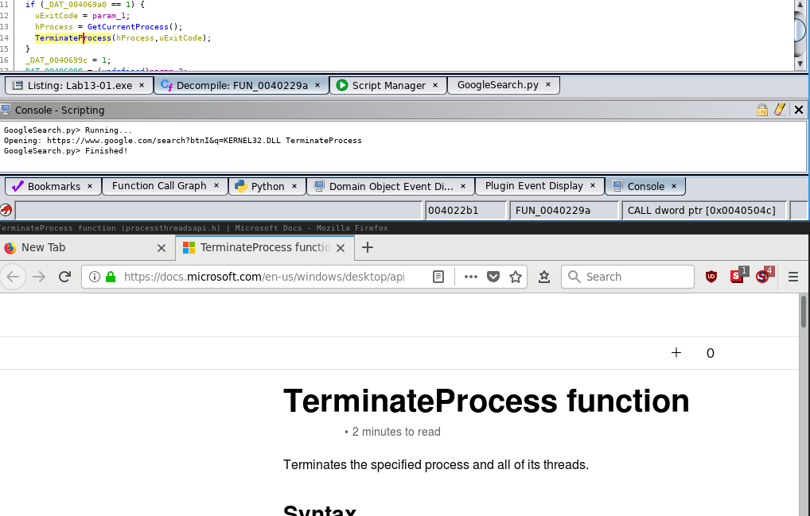

# GoogleSearch.py

This Ghidra script allows you to quickly search function names online.

## Dependencies

- Needs `firefox` in `$PATH`

## Usage

1. Click function you would like to search online (i.e. set the current address to that function), either the `call` or the function start
2. Hit `ALT`+`SHIFT`+`G` (you can change the shortcut)
3. Browser pops up with the search result

### Example:

