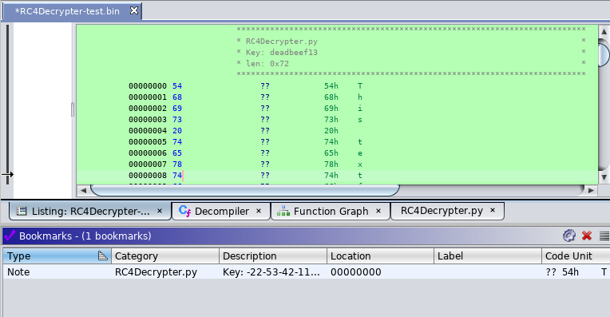

# RC4Decrypter.py

This Ghidra script can be used to perform RC4 decryption.
While `pipeDecoder.py` in combination with `openssl` should cover most decryption
needs RC4 is special, because it has a variable key length, which `openssl` does
not support. `openssl` only supports RC4 with a 40, 80 or 128-bit key. However,
some malware uses e.g. 128-byte keys.

It will place a `PLATE_COMMENT` at the location it was invoked (appending to any previous PLATE comments). It will set a bookmark.

## Issues

- Each selection range is processed individually. This means if you have 3 selections, each is decrypted separately.

## Usage

1. Find RC4 key and keep it ready for pasting.
2. Select what should be decrypted.
3. Run `RC4Decrypter.py`
4. Paste the key bytes into the modal window (Note: Because this window is modal you can't copy the key anymore from within Ghidra, hence see 1.).
5. Selection is decrypted.

### Example:

Generate test data:

```
echo "This textfile is to test the correct functionality of the RC4Decrypter.py Ghidra script. RC4 doesn't need pading." | openssl enc -e -rc4-40 -K "deadbeef13" > RC4Decrypter-test.bin
```

`RC4Decryper-test.bin` can then be decoded by invoking `RC4Decrypter.py` with:

```
deadbeef13
```




