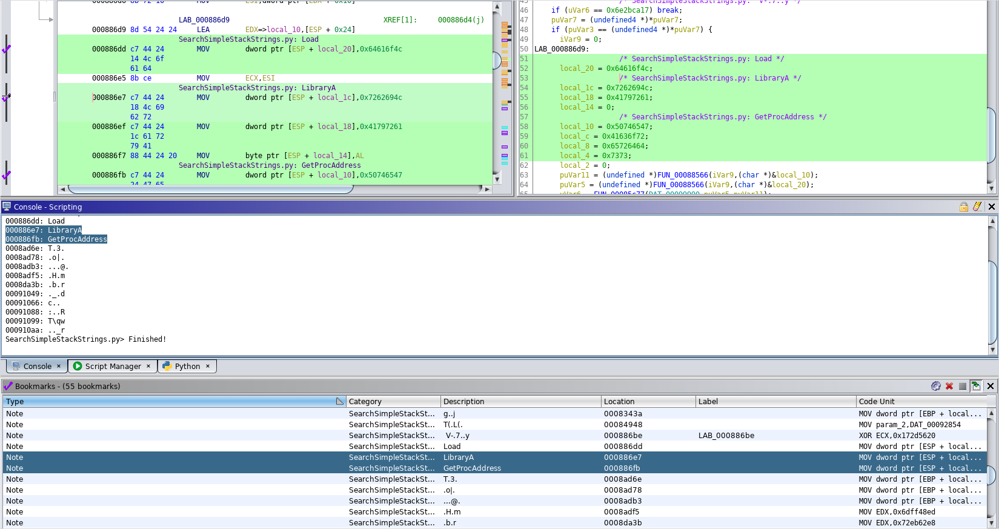

# SearchSimpleStackStrings.py

Searches and reasemble ASCII stack string formed via repeated instructions of:

```
MOV dword ptr [0xffffff6c + EBP],0x70747468
MOV dword ptr [0xffffff70 + EBP],0x2f2f3a73
MOV dword ptr [0xffffff78 + EBP],0x66746f68
...
```

or

```
MOV byte ptr [EBP + 0x10],0x68
MOV byte ptr [EBP + 0x11],0x74
MOV byte ptr [EBP + 0x12],0x74
```

This script works like the [`SimpleStackStrings.py`](SimpleStackStrings.py) script,
but actually searches through all instructions in all functions of the program and
tries to extract stack strings of `MIN_STRING_LEN` of 4 and with an ASCII character
content over 45 %.

The script only considers what is in the source scalar, i.e. the `0x70747468` parts on the right of the comma.
The left side is irrelevant. Hence this also works on different constructs but this also causes issues (see [Issues]).

It will place a `PRE_COMMENT` at the location it was invoked (appending to any existing comments).

## Issues

- Only works when instructions loading the string are in loading order (that is destination order is not evaluated)
- Only works with ASCII

## Usage

1. Run the script.
2. Look for output in Console Window.
3. Go through the bookmarks to directly jump to interesting findings.

### Example:




