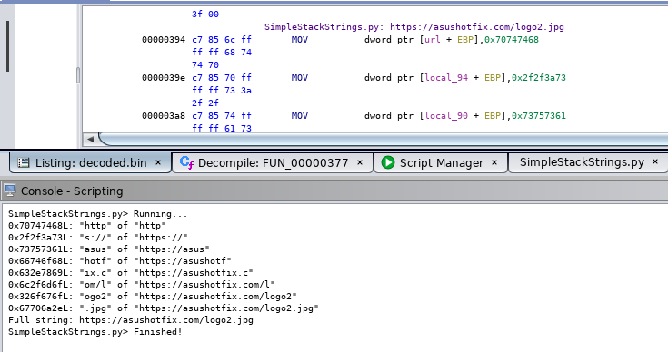

# SimpleStackStrings.py

Reasemble an ASCII stack string formed via repeated instructions of:

```
MOV dword ptr [0xffffff6c + EBP],0x70747468
MOV dword ptr [0xffffff70 + EBP],0x2f2f3a73
MOV dword ptr [0xffffff78 + EBP],0x66746f68
...
```

or

```
MOV byte ptr [EBP + 0x10],0x68
MOV byte ptr [EBP + 0x11],0x74
MOV byte ptr [EBP + 0x12],0x74
```


Set current address to beginning of first instruction of above stack string code segment.
The script will write the assembled string as a comment (**overwriting any existing comments**).

The script only considers what is in the source scalar, i.e. the `0x70747468` parts on the right of the comma.
The left side is irrelevant. Hence this also works on different constructs but this also causes issues (see [Issues]).

It will place a `PRE_COMMENT` at the location it was invoked (overwriting any previous PRE comments).

## Issues

- Only works when instructions loading the string are in loading order (that is destination order is not evaluated)
- Only works with ASCII

## Usage

1. Set current address to beginning of first instruction of the stack string code construct.
2. Run the script.

### Example:




