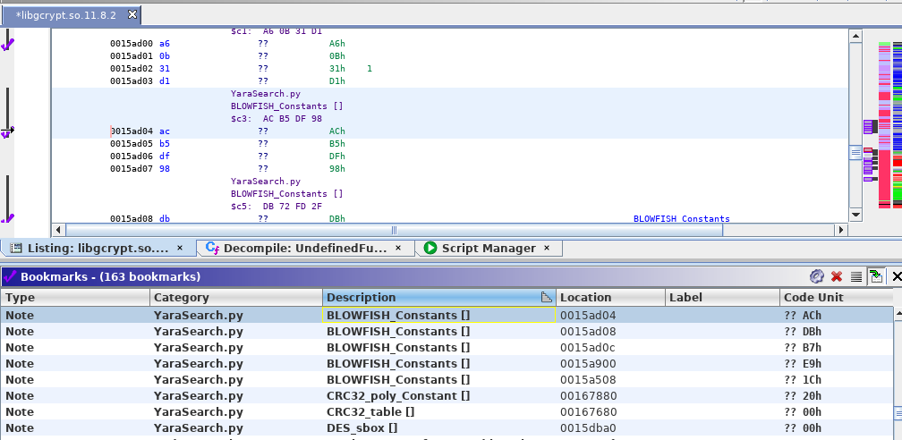

# YaraSearch.py

This Ghidra script provides a YARA search.
It will place a `PRE_COMMENT` at the location of each match.
It will set bookmarks for each match.

## Dependencies

- `yara` must by in `$PATH`; you can get `yara` here: https://github.com/VirusTotal/yara

## Issues

- If matches are found in code which are not at instruction boundaries a comment can not be set; bookmark for match is still set, though

## Usage

Just run the script and select a YARA rule file (`.yar`).
Get some rules from:

- https://github.com/Yara-Rules/rules/
- https://github.com/Neo23x0/signature-base
- https://github.com/0x6d696368/yara-rules

### Example:

Load your systems local `libcrypt.so` and scan it with https://github.com/Yara-Rules/rules/blob/master/Crypto/crypto_signatures.yar

