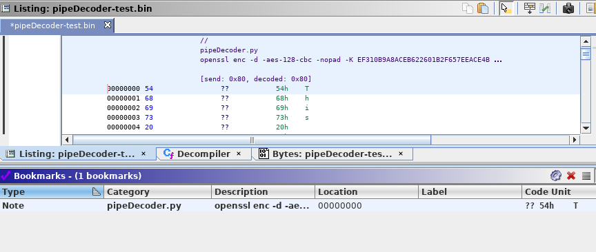

# pipeDecoder.py

This Ghidra script can be used to pipe the data from a selection through a shell process and replacing the data with the decoded output piped back from the shell process.

It will place a `PRE_COMMENT` at the location it was invoked (overwriting any previous PRE comments). It will set a bookmark.

## Issues

- Each selection range is processed individually. This means if you have 3 selections, each is piped to a new invocation of the shell process.
- Due to Python's `subprocess` piping buffer restrictions there is currently a hardlimit on the size that can be processed.

## Usage

`pipeDecoder.py` can be used with programs that accept the data to be decoded via
`stdin` and output the decoded data to `stdout`.

### Example:

Generate test data:

```
echo "This textfile is to test the correct functionality of the pipeDecoder.py Ghidra script. padpadpadpadpadpadpadpadpadpadpadpadpad" | openssl enc -e -aes-128-cbc -nopad -K EF310B9A8ACEB622601B2F657EEACE4B -iv 0 > pipeDecoder-test.bin
```

`pipeDecoder-test.bin` can then be decoded by invoking `pipeDecoder.py` with:

```
openssl enc -d -aes-128-cbc -nopad -K EF310B9A8ACEB622601B2F657EEACE4B -iv 0
```




